# What's Good

What's Good is a content-based social media app.

## About What's Good

As our world becomes increasingly driven by social media and, sadly, polarized along politico-cultural lines, it seems apparent that social media is increasingly co-opted as a tool to drive wedges between social niches. Our vision with What's Good was to carve out a positive space on the web by creating a social media platform for friendly interaction concentrated around shared tastes in books, games, movies, and music. Here, friends are invited to comment on their favorite (or not-so-favorite!) music, share a film they recently watched, rate the newest video games, write reviews on books both new and old, or preferrably, all of the above! We wanted to provide a forum for people to put a virtual representation of their favorite media on display, and we hope you enjoy it!

You can join the fun [here](https://whatsgood-v1.herokuapp.com/).

## Table of Contents

* [Usage](#Usage)
* [Dependencies](#Dependencies)
* [APIs](#APIs)
* [Contributors](#Contributors)

## Usage

### Signup/Login

Navigating to https://whatsgood-v1.herokuapp.com/ brings you to the signup/login page. In addition to signing up with a username and good password, please include your first and last names. This makes it easier for other Whats Gooders to find and connect with you in the 'Search Friends' page.

## 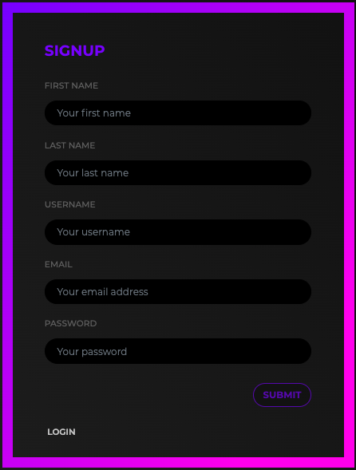

## 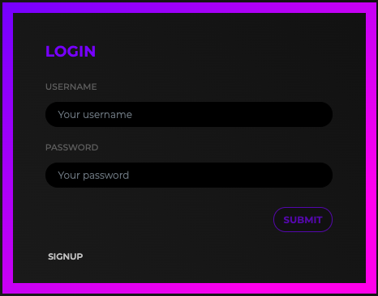

### Navbar

The navbar will get you where need to go. Search for media and friends, peruse your exisiting media and friends collection, or tap the profile avatar to upload a photo, access your profile, see your messages, logout, or toggle light/dark modes.

## 

## 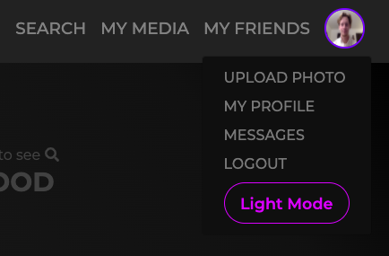

### Search

At the core of What's Good is the ability to search for music, movies, games, books, and friends. To begin your search, click the 'SEARCH' button at the left of the navbar and select the icon of what you would like to search.

## 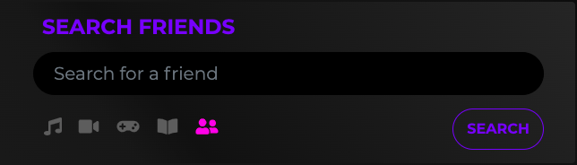

### Searching for Friends

What's Good will search for friends by their first name, last name, and username. It will find anyone that has a consecutive string of letters in any of their names that matches the search input, and it is case insensitive. So, if you type in the letter 'd' you will find any user with 'd' in any of their names. Of course, searching by a friend's full name will return a more specific result. If you want to follow someone's content, click 'Add Friend' at the bottom of the card.

## 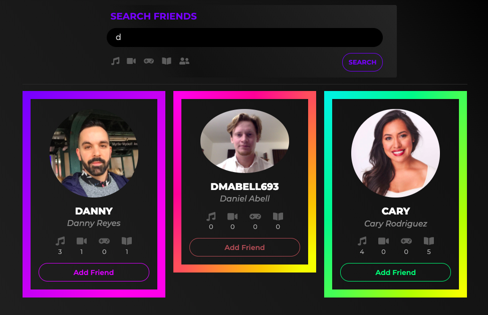

### Media Search

What's Good makes calls to a variety of [APIs](#APIs) to retrieve data for each media type. A search in each media type will return a media-specific card based on the query results.

### Rate, Review, Save Media

After you find the media you're looking for, you can rate it, review it, and save it at one time! If you forget to rate and review when you save it, or if you would like to update your rating or review, don't worry. You can do that in your 'MY MEDIA' section.

## 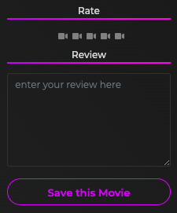

### My Media

You can access your media by clicking on the 'MY MEDIA' link in the middle of the navbar. From there, you can see everything in your media collection or filter through it by media type.

## 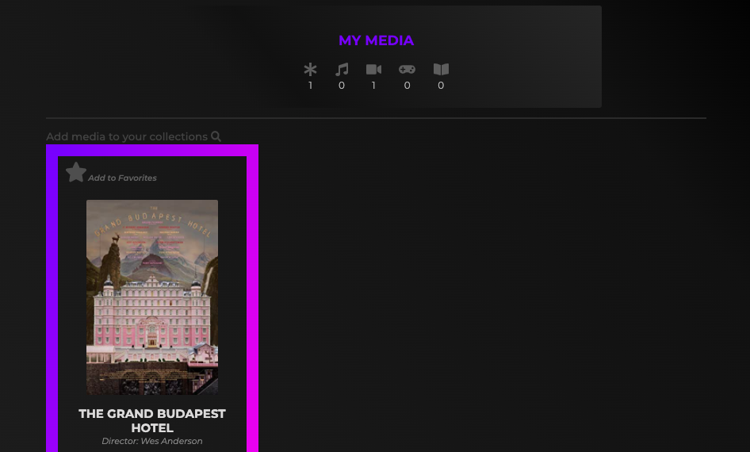

### My Favorites

If something in your collection is worthy of being considered a favorite, you can make it so! Click the star at the top left of the media card and it will be saved to your favorites. Conversely, if a thing gets worse over time, you can delete it from your collection by clicking 'Delete this *media type*!' at the bottom of the media card.

## 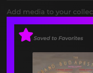

### Home Feed

It's time to see what your friends have been adding to their collection! At the top left of the page you will find our app's name. Click it to access your home feed. Oh, and this is also where you will land every time you log in to What's Good.

## 

### Comment, Like, Visit a Profile

This is where the true magic of What's Good happens. In your home feed you will see the latest media your friends have saved to their collections in a tidy card. You can see how they rated and reviewed this media. And, you can share your enthusiasm (or lack thereof!) by 'liking' this media or commenting on it. You can also visit this friend's profile by clicking on their avatar or username (top left).

## 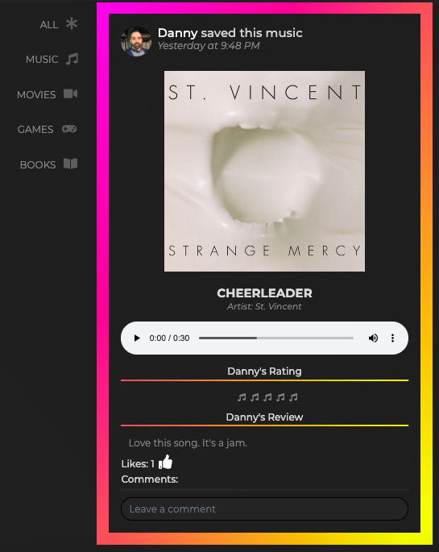

### Profile

Speaking of profiles, you can access yours at the top left of the screen by clicking on your username.

## 

Once there, you can add a bio, access your inbox, navigate to your saved media collection, or see your friends.

## 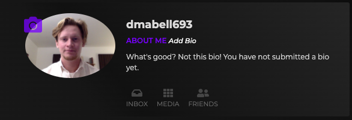

Further down, you can filter through a chronological feed of your own media collection. Select all, favorites, or a specific media type on the sidebar.

## 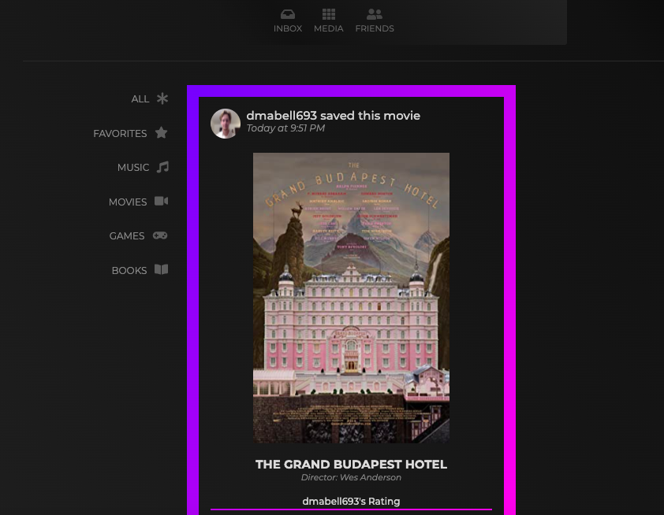

### Notifications

We realized that a social media app isn't really social unless if you know someone has seen what you've posted. So, any time someone likes or comments on media you've posted or sends you a message, you'll get a notification. Notifications appear as a number beside your profile avatar. To see them, click the avatar and the notifications will be added to the dropdown menu. To delete the notification, click the 'trash' icon. To follow up on the notification, click the notification! For instance, if someone messages you you will receive a notification. Click on that notification to go to your messages.

## 

### Messages

What's Good features a fully self-contained messaging app. You can navigate to it by clicking a message notification or from your profile. Once there, you can search for friends to message, or, if a friend has sent you a message their username will appear in the sidebar. Click on it to access your conversation history. To send a new message, type your text in the input area at the bottom of the page. Press 'enter' or clicking the 'paper airplane' icon.

## 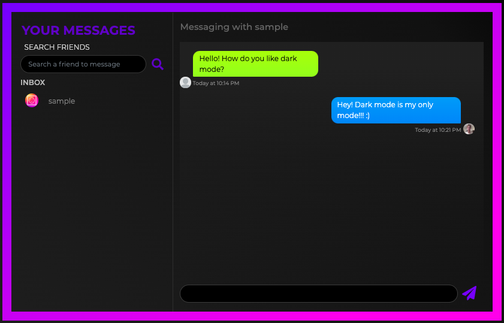

Those are the basics! Now go and share your media!!

## Dependencies

We used [React](https://reactjs.org/) to create the UI. The following libraries comprise bits and pieces of functionality:

* [react-dom](https://www.npmjs.com/package/react-dom) does the DOM rendering
* [react-router-dom](https://www.npmjs.com/package/react-router-dom) handles client-side routes
* [react-bootstrap](https://www.npmjs.com/package/react-bootstrap) for styling
* [react-scroll](https://www.npmjs.com/package/react-scroll) handles scroll animation
* [react-audio-player](#ttps://www.npmjs.com/package/react-audio-player) enable audio playback
* [react-fontawesome](https://www.npmjs.com/package/@fortawesome/react-fontawesome) renders all the cool icons
* [aos](#ttps://www.npmjs.com/package/aos) provides some scrolling animation
* [moment](https://www.npmjs.com/package/moment) for time stamping
* [axios](https://www.npmjs.com/package/axios) facilitates client to server api calls
* [jsonwebtoken](https://www.npmjs.com/package/jsonwebtoken) powers our user authentication services
* [jwt-decode](https://www.npmjs.com/package/jwt-decode) for jsonwebtoken decoding
* [bcrypt](https://www.npmjs.com/package/bcrypt) handles password hashing
* [express](https://www.npmjs.com/package/express) handles api routes 
* [mongoose](https://mongoosejs.com/) handles object modeling for our database 
* [MondoDB](https://www.mongodb.com/) our database, our brain

## APIs

Our media data comes from the following APIs:
* [Google Books APIs](https://developers.google.com/books)
* [Chicken Coop](https://rapidapi.com/valkiki/api/chicken-coop/details)
* [OMDB API](http://www.omdbapi.com/)
* [Deezer](https://developers.deezer.com/)

## Contributors

### Emilia Josefina Hartline
  - [GitHub](https://github.com/emijoha)
  - [LinkedIn](https://www.linkedin.com/in/emilia-josefina-hartline-a14ab21a0/)
  - email: ejhartline@gmail.com

### Roger Pouncey
  - [GitHub](https://github.com/rpounceyjr)
  - [LinkedIn](https://www.linkedin.com/in/roger-pouncey-48568b198/)
  - email: rpounceyjr@gmail.com

### Danny Reyes
  - [GitHub](https://github.com/reyesdmusic)
  - [LinkedIn](https://www.linkedin.com/in/danny-reyes-dev/)
  - email: reyesdmusic@gmail.com

### Daniel Abell
  - [GitHub](https://github.com/dmabell693)
  - [LinkedIn](https://www.linkedin.com/in/daniel-abell-782350199/)
  - email: dmabell693@gmail.com
